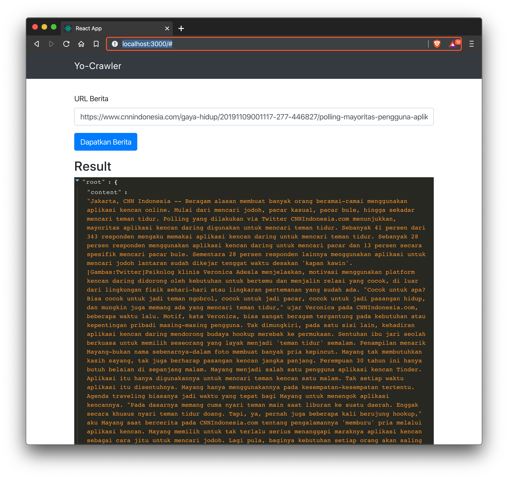

# Yo! Crawler

Simple news crawling machine for a real quick answer!



# Installation & Development

## Go

```
go mod download
go run github.com/pedox/yo-crawler/cmd/server
```

## React Clients

```
cd client
npm install
npm start
```

## Testing

```
go test -timeout 30s github.com/pedox/yo-crawler/crawler -v
```

http://localhost:3000

## Library i used

- [goquery](github.com/PuerkitoBio/goquery)
- [GoOse](github.com/advancedlogic/GoOse)
- [echo.v4](github.com/labstack/echo/v4)
